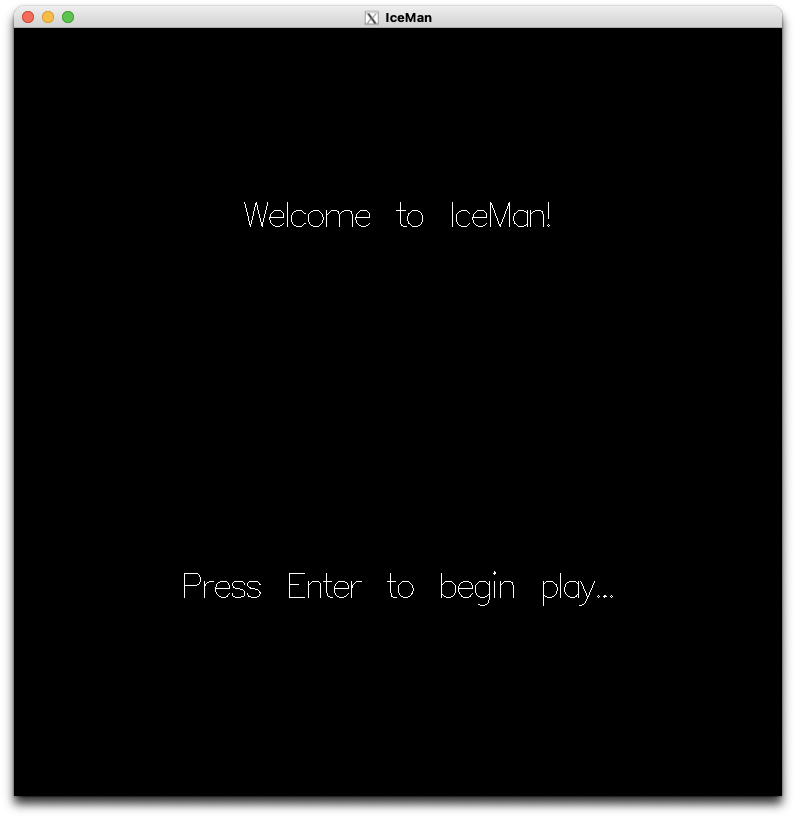
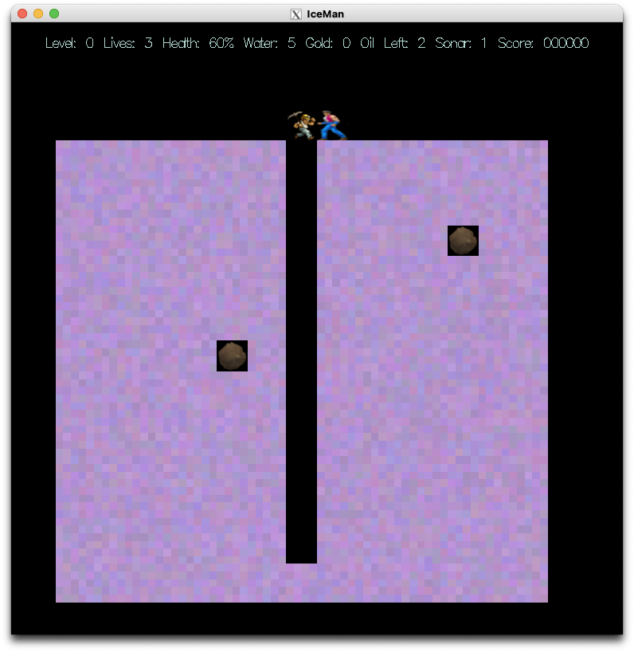
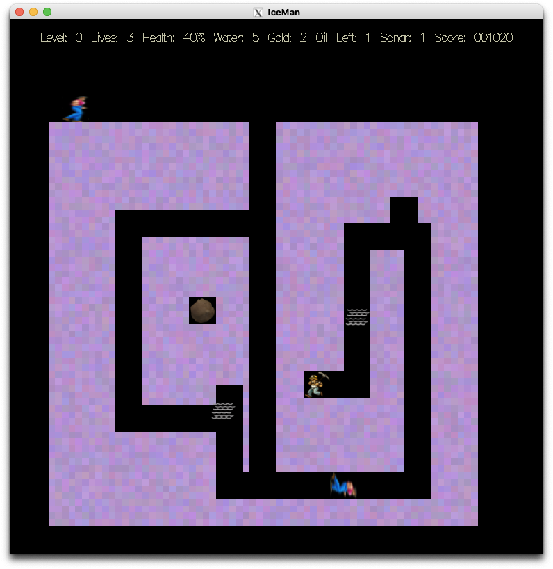
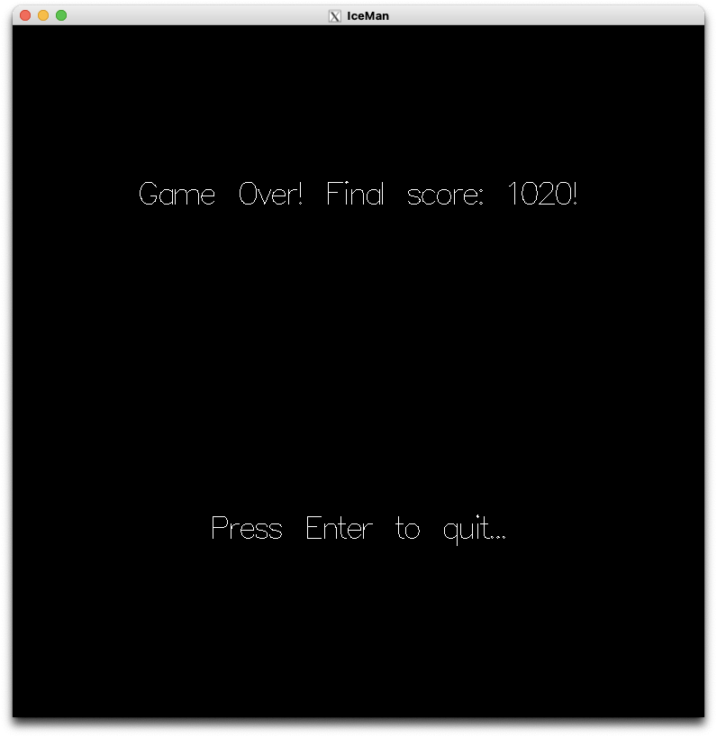

# IceMan Project

This project was worked on by me and my partner, Jonas Fahrney.
The only files that we were responsible for in this repository is Actor.h, Actor.cpp, StudentWorld.h, StudentWorld.cpp.
The rest of the files in this reposity were given to us by Professor Solomon Russell at El Camino College.
The files provided to us are responsible for the game engine, and dealing with displaying all the different sounds and sprite images.
My partner and I were resposible for displaying the different sprites, controling the player, and making the behavior for the enemy characters and all other objects that spawn in.

## Screenshots

